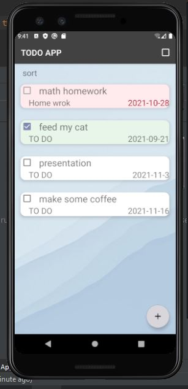
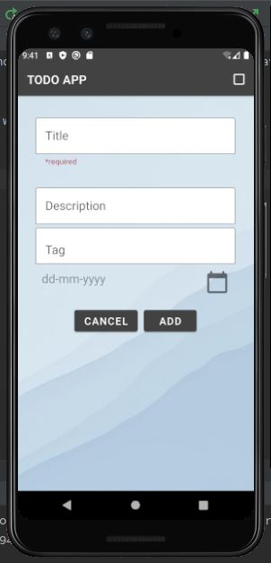

# TODO APP
---

<!--- Replace <OWNER> with your Github Username and <REPOSITORY> with the name of your repository. -->
<!--- You can find both of these in the url bar when you open your repository in github. -->

## :scroll: Description
---

This is a To do list app
It’s a list of tasks you need to complete, or things that you want to do.
you can add, edit, delete and sort tasks

Concepts that have been implemented:

Recycler View, Fragments, Fragments Navigation, View Model, Repository Pattern, Live Data, Room Database, Coroutines, Parcelize, Extensions, Bottom sheet, Sort through data from Room

## :bulb: Motivation and Context
---

This application was made for - Tuwaiq Academy 'Android Capstone 1 Assignment' 
## :camera_flash: Screenshots
---
### screenshot_1
 

### screenshot_2
  

### screenshot_3
  

### screenshot_4

