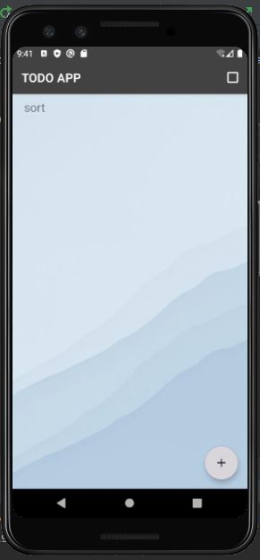

# TODO APP
---

<!--- Replace <OWNER> with your Github Username and <REPOSITORY> with the name of your repository. -->
<!--- You can find both of these in the url bar when you open your repository in github. -->

## :scroll: Description
---
//This is my application description, what you have learned and what you, and what the ideas you have added in this app

This is a To do list app
It’s a list of tasks you need to complete, or things that you want to do.
you can add, edit and delete tasks

## :bulb: Motivation and Context
---
//Write your motivation here

## :camera_flash: Screenshots
---
### screenshot_1

### screenshot_2
